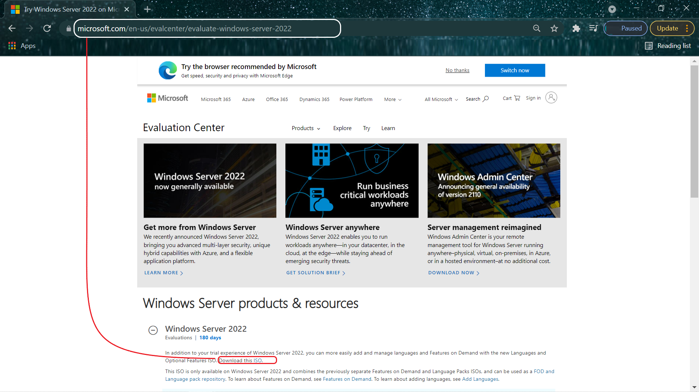
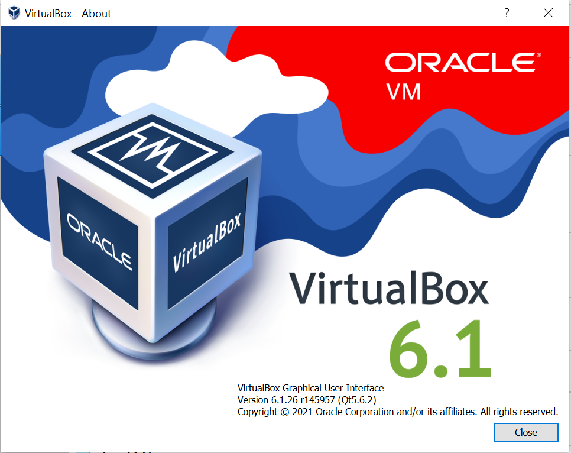
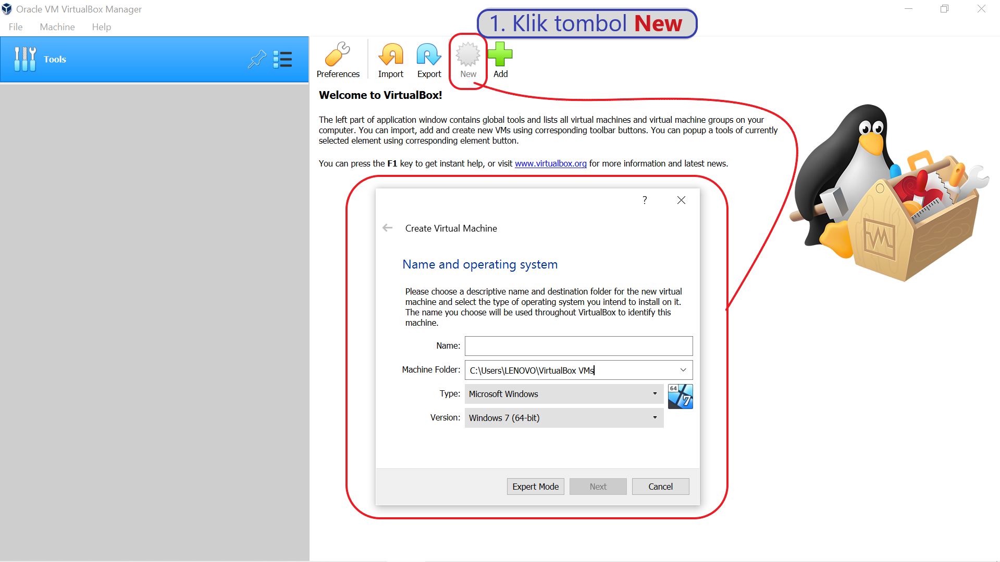
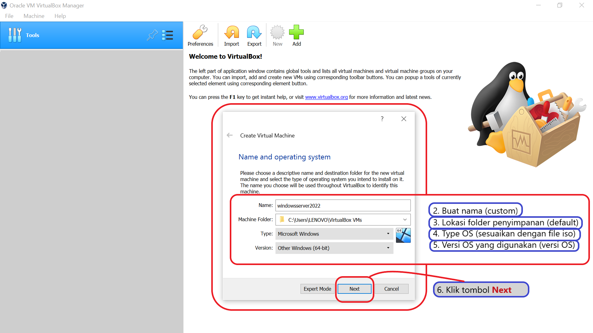
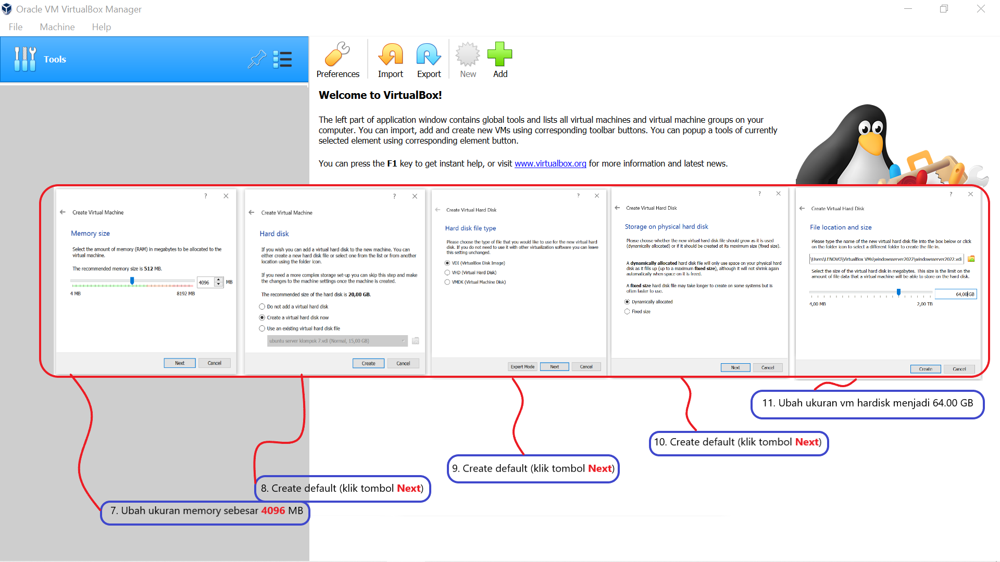
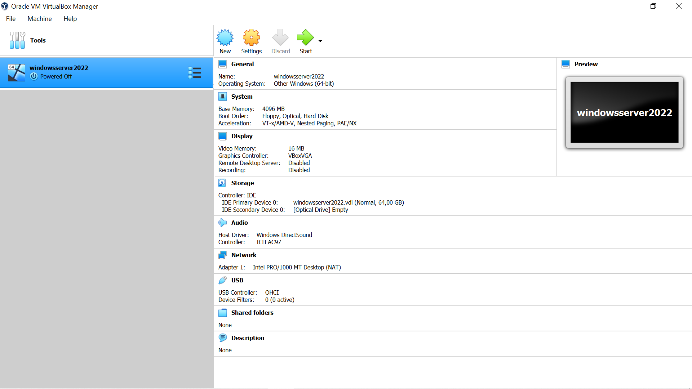

<!-- PROJECT LOGO -->
  <h3 align="center">Install Windows Server 2022 di VirtualBox 6.1 version
</h3>

  <p align="center">
    Install your iso in microsoft windows server 2022
  </p>
</div>



Link Download iso windows server 2022 at [https://www.microsoft.com/en-us/evalcenter/evaluate-windows-server-2022](https://www.microsoft.com/en-us/evalcenter/evaluate-windows-server-2022)

## UTS
<!--Soal UTS -->
<details>
  <summary>Soal dan Jawaban UTS</summary>
  <ol>
    <li>Download-ISO-Installer-windows-server-2022">Download ISO Installer windows server 2022
      <ul type="square">
        <li>https://www.microsoft.com/en-us/evalcenter/evaluate-windows-server-2022</li>
      </ul>
    </li>
    <li>Buat sebuah dokumentasi instalasi di github yang berisi
      <ol type="a">
        <li><a href="#Installation">Instalasi windows server 2022</a></li>
        <li><a href="#Directory">Instalasi Active Directory Domain Services</a></li>
        <li><a href="#DNS">Instalasi DNS server</a></li>
        <li><a href="#NET">Instalasi Net Framework 3.5</a></li>
        <li><a href="#Promote">Promote Server to a Domain Controller</a></li>        
      </ol>
    </li>
    <li>Kriteria Pengerjaan</li>
      <ol type="a">
        <li>Dokumentasi pada github dengan format markdown</li>
        <li>Memberikan penjelasan beserta screenshoot Langkah Langkah instalasi</li>
        <li>Cukup mengerjakan poin no 2.A</li>
        <li>Poin no 2-B sampai 2-E boleh dikerjakan, nilai dari poin no 2-B sampai 2-E bisa mengatrol nilai praktikum atau nilai UAS.</li>
      </ol>
    </li>
    <li>Referensi yang berguna:</li>
      <ul>
        <li>https://xpertstec.com/how-to-install-active-directory-in-server-2022/#Promote-Server-to-a-Domain-Controller</li>
        <li>https://docplayer.info/56976616-Laporan-instalasi-dan-konfigurasi-windows-server-2003.html</li>
      </ul>
    </li>    
  </ol>
</details>


<!-- ABOUT THE PROJECT -->
---
# Installation
---
## Cara Install Windows Server 2022 di VirtualBox 6.1 version
----



Steps to install :
* Download and Install VirtualBox VM
* Download file iso Windows Server 2022 in top-linked
* Open your VirtualBox VM
* Create new your OS - Windows Server 2022 to installation

<p align="right">(<a href="#top">back to top</a>)</p>


### Steps on VirtualBox to create OS Windows Server

Steps to install and configuration

* Create on `New`
---
  
  
  
  
* [React.js](https://reactjs.org/)
* [Vue.js](https://vuejs.org/)
* [Angular](https://angular.io/)
* [Svelte](https://svelte.dev/)
* [Laravel](https://laravel.com)
* [Bootstrap](https://getbootstrap.com)
* [JQuery](https://jquery.com)

<p align="right">(<a href="#top">back to top</a>)</p>


<!-- GETTING STARTED -->


## Directory

This is an example of how you may give instructions on setting up your project locally.
To get a local copy up and running follow these simple example steps.
## DNS

This is an example of how you may give instructions on setting up your project locally.
To get a local copy up and running follow these simple example steps.
## NET

This is an example of how you may give instructions on setting up your project locally.
To get a local copy up and running follow these simple example steps.

## Promote

This is an example of how you may give instructions on setting up your project locally.
To get a local copy up and running follow these simple example steps.


<!-- GETTING STARTED -->
## Getting Started

This is an example of how you may give instructions on setting up your project locally.
To get a local copy up and running follow these simple example steps.

### Prerequisites

This is an example of how to list things you need to use the software and how to install them.
* npm
  ```sh
  npm install npm@latest -g
  ```

### Installation

_Below is an example of how you can instruct your audience on installing and setting up your app. This template doesn't rely on any external dependencies or services._

1. Get a free API Key at [https://example.com](https://example.com)
2. Clone the repo
   ```sh
   git clone https://github.com/your_username_/Project-Name.git
   ```
3. Install NPM packages
   ```sh
   npm install
   ```
4. Enter your API in `config.js`
   ```js
   const API_KEY = 'ENTER YOUR API';
   ```

<p align="right">(<a href="#UTS">back to top</a>)</p>
